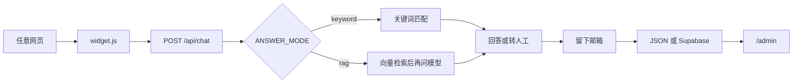

# 星河大学 FAQ 智能客服小部件

A one-line `<script>` FAQ chat widget for any website. It answers only from your FAQ file and, when it cannot, collects an email for human follow-up. Keyword matching is free; an optional RAG mode uses embeddings plus a language model.

这是一个可嵌入任意网页的 FAQ 聊天小部件：访客在右下角提问，系统只根据项目里的 FAQ 回答；资料里没有的问题不会编造，而是请访客留下邮箱转人工。演示场景是虚构学校「星河大学」，名称、内容和页面都不是真实学校。

**线上演示：** https://faq-widget-silk.vercel.app

## 一行嵌入

把下面这一行放到任意 HTML 页面即可出现右下角聊天气泡（接口地址会从脚本 `src` 推断）：

```html
<script src="https://faq-widget-silk.vercel.app/widget.js" defer></script>
```

也可加上 `data-title="星河大学智能助手"`；需要时用 `data-api` 覆盖接口地址。

## 功能

- **关键词版（零成本）**：不调用模型。用汉字二元组相似度匹配 FAQ，命中则返回答案和相关问题建议；对不上就转人工。
- **AI 版（RAG）**：用阿里云百炼把问题变成向量，在 FAQ 向量里取最相近的几条，再交给 DeepSeek 按资料作答。用环境变量 `ANSWER_MODE` 与关键词版切换。
- **转人工**：答不上来时弹出表单（邮箱必填 + 问题可改），提交后提示招生办会邮件回复。第一版不真正发邮件。
- **后台**：访问 `/admin`，输入管理员密码后查看留言（时间、邮箱、问题、机器人原先的回答）。

## 架构

访客网页只加载 `widget.js`。小部件用 Shadow DOM 画聊天窗，样式和宿主页面互不影响。提问走 `POST /api/chat`；留言走 `POST /api/leads`，管理员在 `/admin` 查看。



| 开关 | 取值 | 不写时 |
|---|---|---|
| `ANSWER_MODE` | `keyword` 或 `rag` | `keyword`，不调用付费接口 |
| `STORE` | `json` 或 `supabase` | `json`，留言写在本地文件 |

FAQ 以 `data/faq.md` 文件维护，不提供后台上传。本地留言是 `data/leads.json`（不提交 git）；线上用 Supabase 的 `leads` 表。

## 防编造（AI 版）

1. **相似度阈值 0.55**：问题向量与 FAQ 的最高分低于 0.55 时，不调用大模型，直接转人工。
2. **`[NO_ANSWER]`**：过线后只把最相关的 3 条 FAQ 发给模型。提示词要求只能依据这些资料回答；资料里没有的电话、日期、金额等只能输出 `[NO_ANSWER]`，接口收到后转人工。
3. **低 temperature**：生成时温度为 0.2，减少随意发挥。

关键词版不调用模型，匹配不上同样转人工。

## 本地运行

```bash
npm install
copy .env.example .env.local
```

在 `.env.local` 里按需填写（密钥不要提交 git）：

| 变量 | 作用 |
|---|---|
| `ANSWER_MODE` | `keyword` 或 `rag`。不写则关键词版 |
| `STORE` | `json` 或 `supabase`。不写则本地 JSON |
| `ADMIN_PASSWORD` | `/admin` 登录密码。本地至少要填这个 |
| `DEEPSEEK_API_KEY` | AI 版生成回答。关键词版可留空 |
| `DEEPSEEK_BASE_URL` | DeepSeek 接口地址，一般用示例里的默认值 |
| `DASHSCOPE_API_KEY` | 阿里云百炼文本向量。AI 版和生成 FAQ 向量时需要 |
| `SUPABASE_URL` | 线上留言库地址。本地 JSON 可留空 |
| `SUPABASE_SERVICE_ROLE_KEY` | 仅服务端使用的密钥，不要用前端可发布的 key，也不要暴露到浏览器 |

```bash
npm run dev
```

用浏览器打开 http://localhost:3000（不要用 `127.0.0.1`，Next 会拦截）。可问「宿舍几点熄灯」；问「校长手机号」应转人工。后台：http://localhost:3000/admin 。

改过 `widget/` 源码后重新打包嵌入脚本：

```bash
npm run build:widget
```

改过 `data/faq.md` 且使用 AI 版时，重新生成向量（需要已填写百炼密钥）：

```bash
npm run build:embeddings
```

改环境变量后要重启 `npm run dev`。本机路径里如果有 `&`，请保持现有 npm 脚本写法（`node ./node_modules/...`），不要改回 `.bin`。

## 部署到 Vercel

Vercel 无服务器函数没有可持久写入的本地磁盘。若 `STORE` 仍是 `json`（或不写），留言会丢或无法保存。

上线时必须设置：

- `STORE=supabase`
- `SUPABASE_URL`
- `SUPABASE_SERVICE_ROLE_KEY`（服务端 JWT，不要用 `sb_publishable_` 开头的那种）
- `ADMIN_PASSWORD`
- 若演示 AI 版：`ANSWER_MODE=rag`，以及 `DEEPSEEK_API_KEY`、`DASHSCOPE_API_KEY`

重新部署后，已提交到 Supabase 的留言应仍在。

## 截图

首页与右下角气泡：


展开后的聊天窗（待补）：把截图放到 `doc/screenshots/chat.png` 后，用下面这行替换本句。

```markdown

```

## 演示视频

30 秒流程：FAQ 命中 → 换说法命中 → 未知问题转人工 → 后台看到留言。

视频文件：仓库根目录 [`演示视频.mp4`](./演示视频.mp4)
