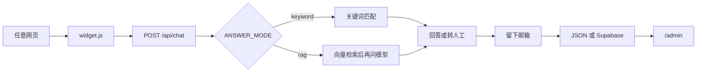

# 星河大学 FAQ 智能客服

演示站：https://faq-widget-naicongh-2112.vercel.app

这是一个可以嵌进任意网页的聊天小部件。它只根据项目里的 `data/faq.md` 回答新生和家长的问题。资料里没有的问题不会编造，而是请访客留下邮箱，管理员在 `/admin` 查看。第一版不发邮件。

学校名称和内容都是虚构的。


## 架构

访客网页只加载 `public/widget.js`。小部件用 Shadow DOM 画聊天窗，样式和宿主页面互不影响。提问发给 Next.js 的 `POST /api/chat`。



两种回答方式用环境变量切换，业务代码不直接绑死某一种：

| 开关 | 取值 | 不写时 |
|---|---|---|
| `ANSWER_MODE` | `keyword` 或 `rag` | `keyword`，不调用付费接口 |
| `STORE` | `json` 或 `supabase` | `json`，留言写在本地文件 |

- **关键词版**：把问题和每条 FAQ 拆成汉字二元组，用 Dice 相似度比较。超过 0.3 返回答案，0.18 以上当作相关建议，最多 3 条。
- **AI 版**：用阿里云百炼 `text-embedding-v4` 把问题变成 1024 维向量，和预先算好的 `data/faq-embeddings.json` 算余弦相似度，取得分最高的 3 条。最高分不低于 0.55 才把这 3 条发给 `deepseek-flash`。调用用的是 `fetch`，没有安装 `openai` 包。

留言通过 `LeadStore` 保存。本地是 `data/leads.json`（不提交 git）。线上是 Supabase 的 `leads` 表，用 REST 访问，没有安装 Supabase 客户端。

## 防编造

AI 版有两道关，避免模型在没有依据时编答案：

1. 检索最高分低于 0.55 时，不调用大模型，直接告诉访客没找到，并打开留言表单。
2. 过了线才把那 3 条 FAQ 交给模型。系统提示要求只能根据这些资料回答；资料里没有电话、日期、金额、地点时，只能回复标记 `[NO_ANSWER]`，不能猜。接口看到这个标记，就改成「我没有在现有 FAQ 里找到这个问题的答案。」并转人工。
3. 请求里 `temperature` 是 0.2，并关闭思考模式，避免模型忽略温度自己发挥。

关键词版不调用模型，匹配不上就同样转人工。

## 本地运行

```bash
npm install
copy .env.example .env.local
```

`.env.local` 里至少填 `ADMIN_PASSWORD`。其余先留空，就是零成本的关键词版。

```bash
npm run dev
```

用浏览器打开 http://localhost:3000 。不要用 `127.0.0.1`，Next 会拦截。右下角点开聊天气泡，可以问「宿舍几点熄灯」。问「校长手机号」应该转人工。留言在 http://localhost:3000/admin ，密码就是 `ADMIN_PASSWORD`。

改成 AI 版时，在 `.env.local` 写入：

```
ANSWER_MODE=rag
DEEPSEEK_API_KEY=你的密钥
DASHSCOPE_API_KEY=你的阿里云百炼密钥
```

改过 `data/faq.md` 后要重新生成向量：

```bash
npm run build:embeddings
```

改环境变量后要重启 `npm run dev`。

线上把留言存进 Supabase 时，再写 `STORE=supabase`、`SUPABASE_URL` 和 `SUPABASE_SERVICE_ROLE_KEY`。服务端密钥不要用 `sb_publishable_` 开头的那种，也不要暴露到前端。

本机项目路径里如果有 `&`，npm 脚本必须保持 `node ./node_modules/...` 这种写法，不要改回 `.bin`。

## 嵌到别的网页

```html
<script src="https://faq-widget-naicongh-2112.vercel.app/widget.js" defer></script>
```

小部件从这段脚本的地址推断接口在哪。宿主页面和演示站不是同一个域名时，公开的 POST 接口已经允许跨域。
